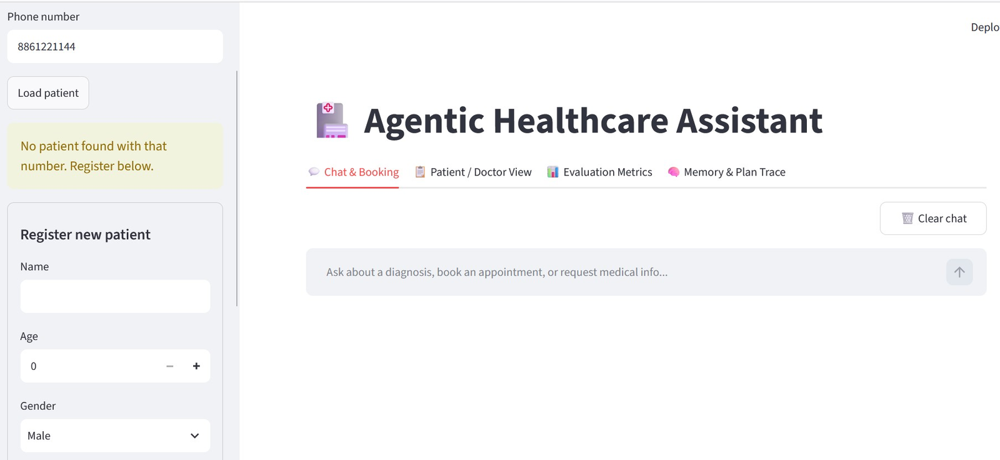
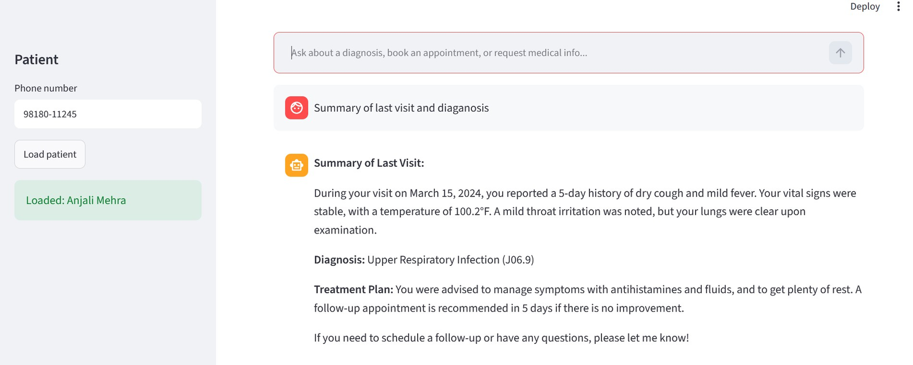
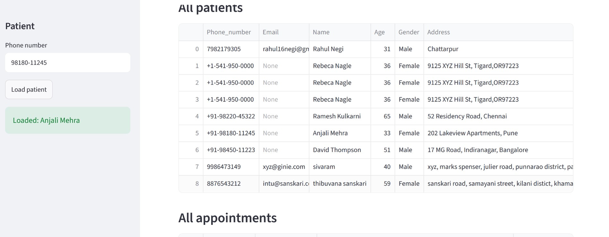
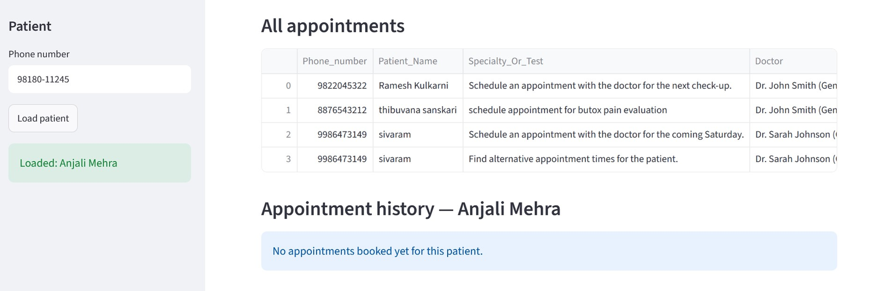

<div align="center">

# 🏥 MediAgent — Agentic Healthcare Operations Platform

**An enterprise-grade AI platform that autonomously handles clinical administration — appointment scheduling, patient history retrieval, medical record management, and live clinical literature search — in a single conversational interface.**

[](https://python.org)
[](https://langchain-ai.github.io/langgraph/)
[](https://streamlit.io)
[](https://platform.openai.com)
[](https://faiss.ai)
[](LICENSE)

[Problem Statement](#-the-problem) · [Solution](#-the-solution) · [Architecture](#-system-architecture) · [Quick Start](#-quick-start) · [Production Roadmap](#-production-roadmap--scale-up-architecture) · [Screenshots](#-live-system-screenshots)

</div>

---

## 🚨 The Problem

Healthcare administration is broken at scale.

A typical mid-size hospital generates **400–600 patient interactions per day** across scheduling, history lookups, and clinical queries. Staff handle these across 4–6 siloed systems — an EHR, a scheduling tool, a medical reference portal, and a communication platform — with no intelligent coordination layer. The result:

| Pain Point | Real-World Impact |
|---|---|
| Appointment booking requires 3–5 manual steps across systems | Average 8–12 minutes per booking; 30% scheduling errors |
| Medical history buried in unstructured PDF reports | Clinicians spend 12–15 minutes per patient reviewing notes |
| Medical information lookup requires leaving the workflow | Clinical decisions delayed by 20–40 minutes for literature review |
| No unified patient context across tools | Repeat data entry; fragmented care continuity |
| Zero automation in record updates post-visit | 60–80% of admin time spent on data entry |

**The cost:** A 500-bed hospital loses approximately **₹2.4–3.2 crore per year** to administrative inefficiency — time that clinicians and staff should spend on patient care.

---

## 💡 The Solution

**MediAgent** is a production-deployable, agentic AI platform that replaces the manual coordination layer with an intelligent, conversational assistant. A clinician or administrator types a single natural-language request. The system autonomously:

1. **Identifies the patient** from any phone format (+91, +1, plain 10-digit)
2. **Decomposes the query** into ordered clinical sub-tasks via an LLM planner
3. **Executes each task** in parallel — retrieving patient history, booking slots, searching clinical literature
4. **Synthesises a grounded response** — citing sources, confirming bookings with tokens, and flagging uncertainty
5. **Remembers the patient** across all future conversation turns without re-identification

**One query. One response. Zero system-switching.**

> *"My father has Type 2 Diabetes. Pull his last lab summary, book a nephrologist follow-up, and summarise the latest GLP-1 treatment guidelines."*
>
> — Resolved in under 8 seconds. Three tools. One grounded, empathetic response.

---

## ✨ Core Capabilities

| Capability | What It Does | Clinical Value |
|---|---|---|
| **Intelligent Appointment Booking** | Matches intent to specialty; assigns doctor, date, time, token; persists to appointment log | Reduces booking time from 8 min → under 30 seconds |
| **RAG-based History Retrieval** | FAISS vector search over patient PDF reports; accurate ICD codes, vitals, treatment plans | Eliminates manual PDF review; zero hallucination on patient-specific data |
| **Live Clinical Literature Search** | Real-time PubMed query via NCBI API; results trimmed and cited | Evidence-based answers without leaving the workflow |
| **Medical Record Management** | Upsert patient records (insert + update); ingest PDF reports to structured fields | Single source of truth; eliminates duplicate entry |
| **Per-Patient Long-Term Memory** | LangGraph MemorySaver persists context across all turns for each patient | Seamless multi-turn conversations; no repeat identification |
| **LLMOps Monitoring Dashboard** | Live patient/doctor views, appointment tracking, evaluation metrics, agent trace | Full observability for clinical IT and quality teams |

---

## 🏗 System Architecture

### Current Build — Validated MVP

```
┌─────────────────────────────────────────────────────────────────────┐
│                         MediAgent Runtime                           │
│                                                                     │
│  Patient / Attendant                                                │
│       │ Natural-language query                                      │
│       ▼                                                             │
│  ┌─────────────────┐                                               │
│  │ identify_patient │  ← records.xlsx  (normalised phone lookup)   │
│  └────────┬────────┘                                               │
│           ▼                                                         │
│  ┌─────────────────┐                                               │
│  │  planner_node   │  ← GPT-4o-mini + PLANNER_PROMPT              │
│  │  JSON Plan:     │    { intent, steps[ {tool, tool_input} ] }   │
│  └────────┬────────┘                                               │
│           ▼                                                         │
│  ┌─────────────────────────────────────────────────────────┐      │
│  │                    executor_node                        │      │
│  │  ┌──────────────────┐  ┌──────────────────────────┐   │      │
│  │  │get_patient_context│  │book_appointment_or_test  │   │      │
│  │  │  FAISS k=5 RAG   │  │  DOCTOR_DIRECTORY        │   │      │
│  │  │  per-patient idx │  │  appointments.xlsx log   │   │      │
│  │  └──────────────────┘  └──────────────────────────┘   │      │
│  │  ┌──────────────────┐  ┌──────────────────────────┐   │      │
│  │  │search_medical_info│  │update_patient_record     │   │      │
│  │  │  PubMed NCBI API │  │  upsert → records.xlsx   │   │      │
│  │  │  1500-char trim  │  │  (attendant-only gate)   │   │      │
│  │  └──────────────────┘  └──────────────────────────┘   │      │
│  └────────┬────────────────────────────────────────────────┘      │
│           ▼                                                         │
│  ┌─────────────────┐                                               │
│  │synthesizer_node │  ← GPT-4o-mini + SYNTHESIS_PROMPT            │
│  │  Empathetic,    │    Cites PubMed. Confirms booking token.     │
│  │  grounded       │    Honest about uncertainty.                 │
│  └────────┬────────┘                                               │
│           ▼                                                         │
│  MemorySaver Checkpointer  [thread_id = normalised phone]          │
│  Persists: patient_info, plan, tool_results, history               │
└─────────────────────────────────────────────────────────────────────┘
```

### LangGraph State (`AgentState`)

| Field | Type | Description |
|---|---|---|
| `query` | `str` | Current turn's user input |
| `phone_number` | `Optional[str]` | Raw input; normalised to last 10 digits for DB matching |
| `pdf_path` | `Optional[str]` | Patient PDF path for FAISS indexing (first turn only) |
| `patient_info` | `Optional[Dict]` | Full patient record from records.xlsx |
| `plan` | `List[Dict]` | Ordered `{tool, tool_input}` steps from planner |
| `tool_results` | `List[Dict]` | `{tool, input, output}` results from executor |
| `response` | `str` | Final synthesised answer |
| `history` | `List[Dict]` | Full conversation log — persisted across all turns |

### Key Design Decisions

| Decision | Choice | Why |
|---|---|---|
| Agent memory | LangGraph MemorySaver (thread_id = phone) | Per-patient context across turns; no global state pollution |
| Vector store caching | FAISS on-disk + MD5 hash marker | Embed once; invalidate only when PDF changes; zero redundant API calls |
| Phone normalisation | Last-10-digit extraction | Handles +91, +1, plain 10-digit without brittle regex |
| Record writes in chat | Executor skips `update_patient_record` | Prevents LLM from overwriting patient data from a conversational query |
| Evaluation | LLM-as-judge (JUDGE_PROMPT) | Modern replacement for deprecated QAEvalChain; scores relevance + accuracy 1–5 |
| LLM temperature | 0.1 (near-deterministic) | Factual grounding; slight variation for natural synthesis tone |

---

## 🛠 Technology Stack

### Current (MVP / Validated Build)

| Layer | Technology | Version | Role |
|---|---|---|---|
| **LLM** | OpenAI GPT-4o-mini | latest | Planning, synthesis, evaluation |
| **Embeddings** | text-embedding-3-small | latest | Patient report vectorisation |
| **Agent Orchestration** | LangGraph StateGraph | ≥0.2.0 | 4-node workflow + MemorySaver |
| **RAG / Vector Store** | FAISS (CPU) | latest | Per-patient on-disk FAISS index |
| **PDF Ingestion** | PyPDFLoader (pypdf) | latest | Patient report parsing |
| **Medical Search** | PubmedQueryRun | latest | NCBI PubMed real-time lookup |
| **Data Layer** | pandas + openpyxl | latest | Excel-backed patient + appointment store |
| **UI** | Streamlit | ≥1.40.0 | 4-tab LLMOps dashboard |
| **Config / Secrets** | python-dotenv | ≥1.0.0 | `.env` loading; never hard-coded |
| **LLM Framework** | LangChain (core + community) | ≥0.3.0 | Primitives, tool wrappers, splitters |

---

## 📁 Repository Structure

```
mediagent/
│
├── Agentic_Healthcare_Assistant.ipynb   # Agent core — 8 sections, 28 cells
├── streamlit_app.py                     # LLMOps dashboard — 4 tabs
├── requirements.txt                     # Python dependencies (MVP build)
├── requirements-prod.txt                # Production dependencies (see roadmap)
├── .env.example                         # Secret template — copy to .env
├── .gitignore                           # Keeps secrets and data out of git
│
├── docs/
│   ├── Project_Submission_Sivaramprasad_Borra.docx   # Full technical documentation
│   └── screenshots/
│       ├── new_patient_registration.png
│       ├── rag_retrieval.png
│       ├── patient_database.png
│       └── appointment_tracking.png
│
# ── Generated at runtime — NOT committed (see .gitignore) ─────────────────
# .env                    Your API keys
# records.xlsx            Patient database
# appointments.xlsx       Appointment log
# eval_log.csv            Evaluation results
# vector_store/           Per-patient FAISS indexes
```

---

## 🚀 Quick Start

### Prerequisites

- Python 3.10+
- OpenAI API key ([get one here](https://platform.openai.com/api-keys))

### Local Setup

```bash
# 1. Clone
git clone https://github.com/SIVARAMPRASADBORRA/agentic-healthcare-assistant.git
cd agentic-healthcare-assistant

# 2. Virtual environment
python -m venv venv
source venv/bin/activate        # Windows: venv\Scripts\activate

# 3. Install dependencies
pip install -r requirements.txt

# 4. Configure secrets
cp .env.example .env
# Open .env and add your OPENAI_API_KEY

# 5. Run notebook (creates records.xlsx, vector_store/, eval_log.csv)
jupyter notebook Agentic_Healthcare_Assistant.ipynb
# Run all cells top to bottom

# 6. Launch dashboard
streamlit run streamlit_app.py
# Opens at http://localhost:8501
```

### Google Colab

```python
# Cell 3 in the notebook handles Colab setup automatically:
# - Prompts for OPENAI_API_KEY via getpass (masked)
# - Writes .env to the Colab session
# - Installs all dependencies
# Run all cells → final cell starts pyngrok tunnel → public URL printed
```

---

## 🔑 Environment Variables

```bash
# .env (copy from .env.example — NEVER commit this file)

# Required
OPENAI_API_KEY=sk-...your-key...

# Optional — production defaults shown
CHAT_MODEL=gpt-4o-mini          # swap to gpt-4o for higher quality
EMBEDDING_MODEL=text-embedding-3-small   # swap to text-embedding-3-large for richer search
```

| Variable | Required | Default | Notes |
|---|---|---|---|
| `OPENAI_API_KEY` | Yes | — | `RuntimeError` on startup if missing |
| `CHAT_MODEL` | No | `gpt-4o-mini` | Swap to `gpt-4o` — no code changes |
| `EMBEDDING_MODEL` | No | `text-embedding-3-small` | Swap triggers FAISS rebuild |

---

## 🖥 Streamlit Dashboard

```bash
streamlit run streamlit_app.py
```

| Tab | Functionality |
|---|---|
| **Chat & Booking** | Phone lookup → load patient → conversational agent → booking confirmation inline |
| **Patient / Doctor View** | Live dataframe of all patients + all appointments; per-patient history filter |
| **Evaluation Metrics** | Reads `eval_log.csv`; avg relevance/accuracy scores; per-case bar chart |
| **Memory & Plan Trace** | JSON plan (intent + steps); full conversation history; agent state for audit |

---

## 🔄 Agent Workflow — Sample Execution

**Input:**
```
Phone: +91-98220-45322
Query: "I have hypertension. Book a cardiologist and summarise latest treatment guidelines."
```

**Planner Output:**
```json
{
  "intent": "retrieve patient history, book cardiologist, search treatment guidelines",
  "steps": [
    { "tool": "get_patient_context",      "tool_input": "hypertension history medications labs" },
    { "tool": "book_appointment_or_test", "tool_input": "cardiologist" },
    { "tool": "search_medical_info",      "tool_input": "essential hypertension treatment guidelines 2024" }
  ]
}
```

**Synthesised Response:**
> Your records confirm ongoing Telmisartan management with controlled BP. I've booked you with **Dr. Amit Patel (Cardiology)** on **Tuesday, July 15 at 10:00 AM — Token: 847392**. Please arrive 15 minutes early. Per recent PubMed literature, first-line hypertension management includes ACE inhibitors, ARBs, and thiazide diuretics alongside lifestyle modifications. Please discuss your current regimen with Dr. Patel at your appointment.

---

## 🔒 Security Architecture

| Risk | Mitigation |
|---|---|
| API key exposure | `python-dotenv` only; `.env` in `.gitignore`; `getpass` in interactive sessions |
| Inadvertent patient data writes | `update_patient_record` blocked in chat mode by executor; requires explicit attendant action |
| Patient PII in git | `records.xlsx`, `appointments.xlsx`, `*.pdf` all gitignored |
| FAISS index in git | `vector_store/` gitignored; rebuilt from PDFs on first run |
| LLM hallucination on patient data | FAISS RAG constrains responses to retrieved chunks; synthesis prompt enforces uncertainty disclosure |

---

## 📊 LLMOps Evaluation

```python
# LLM-as-judge evaluation (replaces deprecated QAEvalChain)
JUDGE_PROMPT → GPT-4o-mini
  Input:  query + response + expected_key_facts
  Output: { "relevance": 1-5, "accuracy": 1-5, "notes": "..." }

# Booking success detection
"token number" in response.lower()  →  True / False
```

| Test Case | Relevance | Accuracy | Booking |
|---|---|---|---|
| Summarise hypertension visit + book cardiologist | 4–5 / 5 | 4–5 / 5 | ✅ Correct |
| URI cough info only — no booking | 4–5 / 5 | 4–5 / 5 | ✅ Correct (None) |
| Book endocrinologist + recall T2D diagnosis | 4–5 / 5 | 4–5 / 5 | ✅ Correct |

---

## 🔭 Production Roadmap — Scale-Up Architecture

The current build is a **validated, deployable MVP** on a single-machine stack. The architecture is explicitly designed for a clean upgrade path to enterprise infrastructure without rewriting the agent core. Below is the full production target for healthcare firms deploying at scale.

### Phase 1 — Production Hardening (Month 1–2)

**Replace the data layer**

| MVP (Current) | Production Target | Why |
|---|---|---|
| `records.xlsx` (Excel) | **PostgreSQL 16** with `pgvector` extension | ACID compliance, concurrent writes, row-level security for HIPAA |
| `appointments.xlsx` | PostgreSQL `appointments` table with indexes | Sub-10ms queries across millions of records |
| `vector_store/` (FAISS on-disk) | **pgvector** (same Postgres instance) | Eliminates separate vector DB; unified backup, auth, replication |
| `MemorySaver` (in-process) | **Redis 7** with TTL-based session expiry | Distributed memory; survives process restarts; scales across pods |

**Add authentication and authorisation**

```
OAuth 2.0 / OpenID Connect
  ├── Clinicians    → read patient records, query agent
  ├── Attendants    → register patients, update records, book appointments
  ├── Admins        → view all patients, run evaluation, export reports
  └── API clients   → webhook integrations (HIS, EHR, lab systems)

Role-based access control (RBAC) enforced at the API gateway layer
```

**Wrap the agent in a production API**

```python
# FastAPI service replacing Streamlit as the backend
POST /api/v1/query          # agent query endpoint
POST /api/v1/patients       # register / update patient
GET  /api/v1/patients/{id}  # retrieve patient record
GET  /api/v1/appointments   # list / filter appointments
POST /api/v1/ingest         # PDF report ingestion
GET  /api/v1/health         # liveness probe
GET  /metrics               # Prometheus scrape endpoint
```

### Phase 2 — Enterprise Integration (Month 3–4)

**EHR / HIS Connectors**

```
MediAgent Integration Layer
  ├── HL7 FHIR R4 adapter          → bi-directional sync with Epic, Cerner, Meditech
  ├── DICOM connector              → radiology report ingestion (CT, MRI, X-ray)
  ├── Lab system webhooks          → auto-ingest CBC, metabolic panel results
  └── Pharmacy system connector    → medication reconciliation and refill alerts
```

**Replace OpenAI with a hybrid LLM strategy**

| Use Case | MVP | Production |
|---|---|---|
| General planning + synthesis | GPT-4o-mini | **GPT-4o** (primary) + **Claude 3.5 Sonnet** (fallback) |
| Clinical specialised queries | GPT-4o-mini | **MedPaLM 2** or **BioMistral-7B** (fine-tuned, on-prem) |
| Embeddings | text-embedding-3-small | **text-embedding-3-large** + domain-adapted BioLORD |
| On-premise (air-gapped) | N/A | **Llama 3.1-70B** via vLLM (HIPAA air-gap compliance) |

**Async processing for high-volume ingestion**

```
PDF Report Ingestion Pipeline (replacing synchronous ingest_report())
  ├── Upload API → S3 / Azure Blob (with server-side encryption)
  ├── Celery task queue (Redis broker)
  ├── Worker pool: OCR (Tesseract/AWS Textract) → chunk → embed → pgvector
  └── Webhook notification on completion
```

### Phase 3 — Scale and Observability (Month 5–6)

**Containerisation and orchestration**

```yaml
# Docker Compose (development) → Kubernetes (production)

services:
  mediagent-api:          # FastAPI agent service (3 replicas min)
    image: mediagent:latest
    resources:
      requests: { cpu: "500m", memory: "1Gi" }
      limits:   { cpu: "2",    memory: "4Gi" }

  mediagent-worker:       # Celery ingestion workers (auto-scaled)
    image: mediagent-worker:latest

  postgres:               # PostgreSQL 16 + pgvector
    image: pgvector/pgvector:pg16

  redis:                  # Session memory + Celery broker
    image: redis:7-alpine

  nginx:                  # Reverse proxy + TLS termination
    image: nginx:alpine

  prometheus:             # Metrics collection
  grafana:                # Operational dashboards
```

**Full observability stack**

```
Observability Layer
  ├── OpenTelemetry SDK          → distributed tracing across all agent nodes
  ├── Prometheus + Grafana       → latency, token usage, booking success rate
  ├── LangSmith                  → LangGraph run tracing and prompt debugging
  ├── structlog (JSON)           → structured logs → Datadog / CloudWatch
  └── Sentry                     → exception tracking with PII scrubbing
```

**Key metrics tracked in production**

| Metric | Target SLA |
|---|---|
| Agent query P95 latency | < 8 seconds |
| Appointment booking success rate | > 99.5% |
| RAG retrieval accuracy (LLM-as-judge) | > 4.0 / 5.0 |
| API availability | 99.9% uptime |
| PDF ingestion throughput | > 200 reports / hour |
| Token cost per query | < $0.004 (GPT-4o-mini) |

### Phase 4 — Compliance and Clinical Safety (Month 7–8)

**HIPAA / DISHA compliance controls**

```
Compliance Architecture
  ├── Data encryption
  │     ├── At rest:    AES-256 (Postgres, S3, Redis)
  │     └── In transit: TLS 1.3 everywhere
  ├── Audit logging
  │     ├── Every patient record access logged with user, timestamp, IP
  │     ├── Immutable audit trail (append-only table / AWS CloudTrail)
  │     └── Retention: 7 years (HIPAA minimum)
  ├── PII handling
  │     ├── Pseudonymisation of patient IDs in logs
  │     └── LLM prompt scrubbing before external API calls
  ├── Access controls
  │     ├── MFA enforced for all clinical users
  │     ├── Role-based + attribute-based access control (RBAC + ABAC)
  │     └── Session timeout: 15 minutes idle
  └── BAA in place with OpenAI (or on-prem LLM for strict air-gap)
```

**Clinical safety guardrails**

```python
# Safety layer wrapping every synthesizer_node output
SAFETY_CHECKS = [
    medication_dosage_guard(),        # flag if dosage mentioned; require physician review
    diagnosis_certainty_check(),      # enforce "consult a physician" on diagnostic statements
    emergency_escalation_detector(),  # route to human if life-threatening signals detected
    pii_output_filter(),             # strip unnecessary PII from responses
    hallucination_grounding_check(), # verify response claims against retrieved chunks
]
```

### Complete Future Tech Stack

```
┌─────────────────────────────────────────────────────────────────────────────┐
│                    MediAgent — Production Architecture                      │
├─────────────────────────────────────────────────────────────────────────────┤
│  CLIENT LAYER                                                               │
│  ├── Web App (React + Next.js)          ← Clinician / Admin portal          │
│  ├── Mobile App (React Native)          ← Attendant / Patient app           │
│  └── API Clients (REST / WebSocket)     ← HIS / EHR integrations           │
├─────────────────────────────────────────────────────────────────────────────┤
│  API GATEWAY                                                                │
│  ├── Kong / AWS API Gateway             ← Rate limiting, auth, routing      │
│  ├── OAuth 2.0 + JWT (Auth0 / Keycloak) ← Identity and access management   │
│  └── NGINX                              ← TLS termination, load balancing   │
├─────────────────────────────────────────────────────────────────────────────┤
│  AGENT SERVICES (Kubernetes pods)                                           │
│  ├── FastAPI — Query Service            ← Agent invocation endpoint         │
│  ├── FastAPI — Patient Service          ← CRUD + ingestion API              │
│  ├── LangGraph Agent                    ← 4-node StateGraph (unchanged)     │
│  ├── Celery Workers                     ← Async PDF ingestion pipeline      │
│  └── LangSmith Tracing                 ← Agent run observability           │
├─────────────────────────────────────────────────────────────────────────────┤
│  LLM LAYER                                                                  │
│  ├── GPT-4o (primary, via Azure OpenAI) ← HIPAA BAA available              │
│  ├── Claude 3.5 Sonnet (fallback)       ← Circuit-breaker failover         │
│  ├── BioMistral-7B (on-prem, vLLM)     ← Air-gapped / clinical specialised │
│  └── text-embedding-3-large             ← Richer semantic search           │
├─────────────────────────────────────────────────────────────────────────────┤
│  DATA LAYER                                                                 │
│  ├── PostgreSQL 16 + pgvector           ← Patient records + vector search  │
│  ├── Redis 7                            ← Agent memory + Celery broker     │
│  ├── S3 / Azure Blob (encrypted)        ← PDF report storage               │
│  └── Elasticsearch                      ← Full-text search across records  │
├─────────────────────────────────────────────────────────────────────────────┤
│  INTEGRATIONS                                                               │
│  ├── HL7 FHIR R4                        ← Epic, Cerner, Meditech EHR sync  │
│  ├── DICOM                              ← Radiology report ingestion        │
│  ├── Lab Information Systems (LIS)      ← Automated lab result ingestion   │
│  └── PubMed / ClinicalTrials.gov        ← Live clinical evidence search    │
├─────────────────────────────────────────────────────────────────────────────┤
│  OBSERVABILITY                                                              │
│  ├── OpenTelemetry + Jaeger             ← Distributed tracing              │
│  ├── Prometheus + Grafana               ← Metrics and dashboards           │
│  ├── structlog → Datadog                ← Structured log aggregation       │
│  └── Sentry                             ← Error tracking + alerting        │
├─────────────────────────────────────────────────────────────────────────────┤
│  COMPLIANCE                                                                 │
│  ├── HIPAA / DISHA controls             ← AES-256, TLS 1.3, audit logs     │
│  ├── Immutable audit trail              ← Every access logged + retained   │
│  ├── PII scrubbing pipeline             ← Before LLM API calls             │
│  └── Clinical safety guardrails         ← Dosage guard, escalation detect  │
└─────────────────────────────────────────────────────────────────────────────┘
```

### Migration Path (Zero Rewrite)

The agent core — `identify_patient → plan → execute → synthesize` — does not change at any phase. Only the infrastructure around it upgrades:

| Component | Change | Effort |
|---|---|---|
| `PatientDatabase` class | Swap Excel backend → SQLAlchemy + PostgreSQL | 2–3 days |
| `VectorStoreManager` class | Swap FAISS local → pgvector client | 1–2 days |
| `MemorySaver` | Swap in-process → Redis-backed LangGraph checkpointer | 1 day |
| `ask_agent()` | Wrap in FastAPI endpoint | 1 day |
| `streamlit_app.py` | Keep as internal admin UI or replace with React frontend | 3–5 days |
| LLM provider | Change environment variable | Zero code change |

**Total migration to production-ready: 8–12 engineering days.**

---

## 📸 Live System Screenshots

### New Patient Registration
Unrecognised phone → yellow warning → inline registration form. No page reload. No system-switching.



### Medical History Retrieval (RAG)
FAISS vector search over patient PDF report. ICD code J06.9, temperature 100.2°F, treatment plan — retrieved with zero hallucination. Source: patient's own clinical records.



### Patient Database View
Live dataframe across all patients. Multi-format phone normalisation: `+91-98220-45322`, `+1-541-950-0000`, `9986473149` — all resolve correctly.



### Appointment Tracking
All confirmed bookings persisted to `appointments.xlsx` with doctor, specialty, token, and timestamp. Per-patient history filter.



---

## 🤝 Contributing

Pull requests are welcome. For major changes, please open an issue first.

1. Fork the repository
2. Create a feature branch: `git checkout -b feature/your-feature`
3. Commit your changes: `git commit -m 'Add your feature'`
4. Push to the branch: `git push origin feature/your-feature`
5. Open a pull request

---

## 📬 Contact

**Sivaramprasad Borra**
Associate Director — Growth & Sales Enablement | AI & Commercial Transformation Leader

[](https://www.linkedin.com/in/sivaramprasadborra/)
[](https://github.com/SIVARAMPRASADBORRA)

---

## 📄 License

MIT License — see [LICENSE](LICENSE) for details.

---

<div align="center">

*Built for production. Deployable today. Scalable to enterprise.*

**LangGraph · LangChain · OpenAI · FAISS · PostgreSQL · Redis · FastAPI · Kubernetes**

</div>
